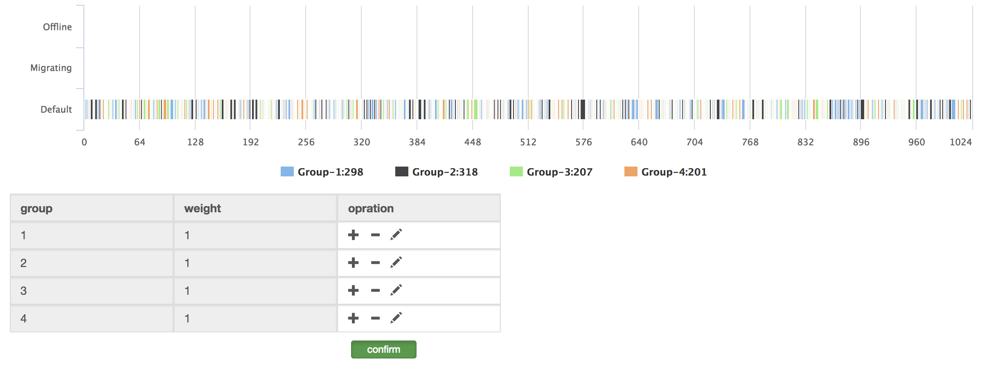

</img>

Codis is a proxy based high performance Redis cluster solution written in Go. It is production-ready and widely used at [wandoujia.com](http://wandoujia.com) and many companies. You can see [Codis Releases](https://github.com/CodisLabs/codis/releases) for latest and most stable realeases.

CodisX is based on the latest version of codis 3.2.

As is known, in production scenarios, we basically use cache in two ways:
1. key-value database, which requires high consistency
2. pure cache, only for the purpose of accelerating data access. In this case, slave servers are not necessary any more. We should use as many master servers as possible.

Thus, I've made some changes to official codis 3.2. Now, you can edit dashboard.conf to change the working mode of codis(only accept 'CP' & 'AP'), and edit proxy.conf to change the retry times of requests in case of server failure.

In CP mode, codisX is just the same as codis 3.2.
While in AP mode, you are supposed to edit weights of each group. When one group fail over, requests will be sent to the next server based on Consistent hash algorithm, which ensures high accessibility to adapt to pure cache scenario.

If you have questions on codisX, feel free to send e-mails to me (e0012443@u.nus.edu).

## Architecture

## Snapshots

GroupWeights

